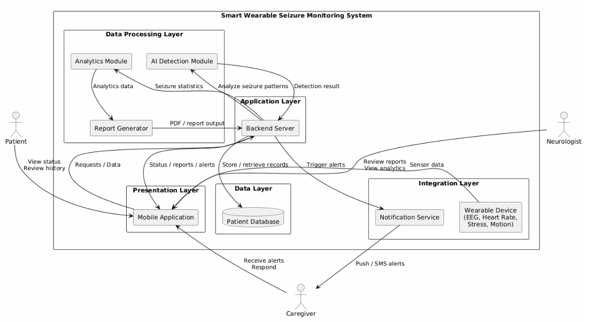
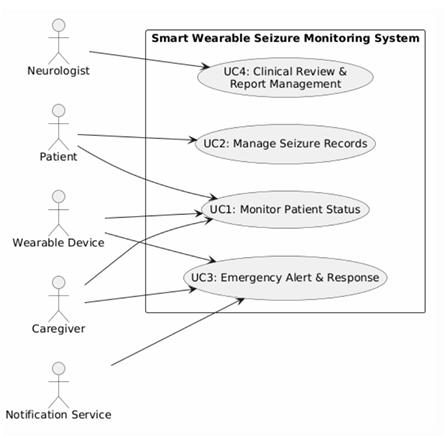
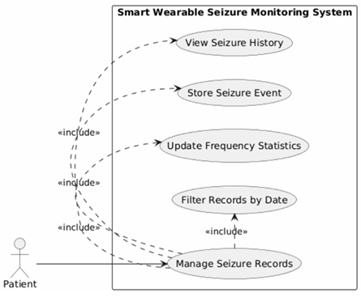
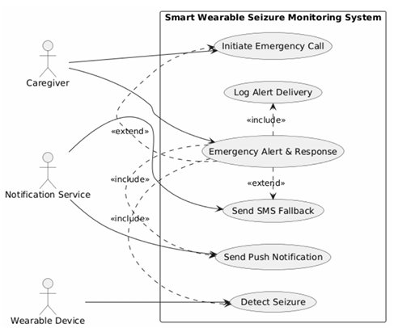
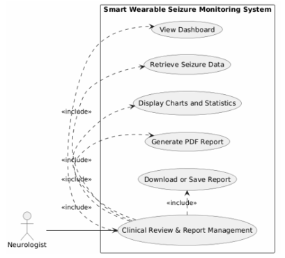
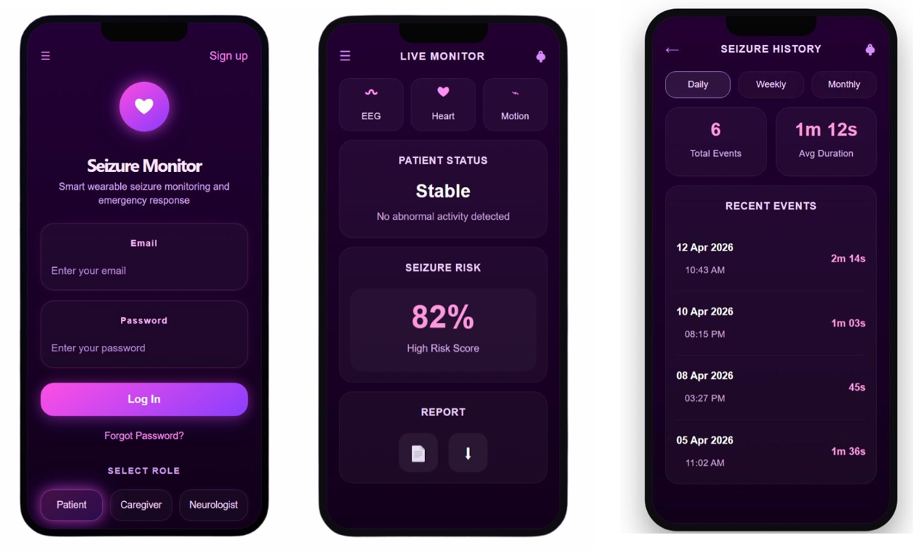
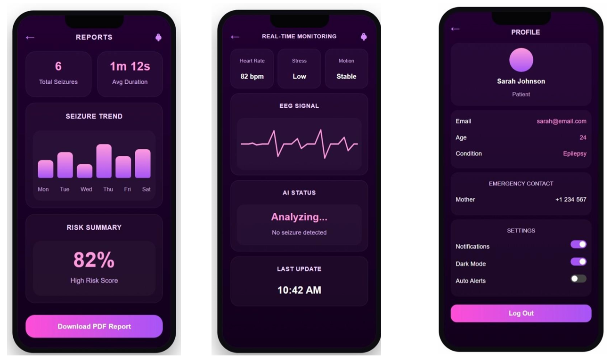

# Smart Wearable Seizure Monitoring System

A software engineering project focused on the design of an AI-enabled wearable seizure monitoring system that combines wearable sensor data, real-time monitoring, emergency alerts, seizure records, and clinical reporting within an integrated system architecture.

> 
## Project Overview

The Smart Wearable Seizure Monitoring System was designed to support people with epilepsy through continuous physiological monitoring and rapid emergency response.

The proposed system integrates a wearable device, mobile application, backend services, patient database, AI-based detection module, notification services, and clinical reporting tools.

The system is designed around three primary users:

- **Patients** — monitor their status and access seizure records.
- **Caregivers** — receive emergency alerts and respond when a seizure is detected.
- **Neurologists** — review seizure information, analytics, and clinical reports.

---

## Key Features

- Real-time wearable sensor monitoring
- EEG, heart rate, stress, and motion data integration
- AI-assisted seizure detection
- Patient status and seizure-risk monitoring
- Automatic emergency alerts
- Push notification and SMS alert support
- Seizure history and event management
- Clinical dashboards and analytics
- PDF report generation
- Patient, caregiver, and neurologist workflows

---

## System Architecture

The system follows a layered architecture consisting of:

- **Presentation Layer** — Mobile Application
- **Application Layer** — Backend Server
- **Data Layer** — Patient Database
- **Data Processing Layer** — AI Detection, Analytics, and Report Generation
- **Integration Layer** — Wearable Device and Notification Service

The architecture connects wearable sensor data with backend processing, patient records, alerts, and clinical reporting.

---

## Use Case Design

The system requirements were modeled through four primary use cases:

1. **Monitor Patient Status**
2. **Manage Seizure Records**
3. **Emergency Alert & Response**
4. **Clinical Review & Report Management**

### Overall Use Case Model

### Patient — Seizure Record Management

### Emergency Alert & Response

### Neurologist — Clinical Review & Reporting

---

## Sequence Diagrams

### Patient Status Monitoring

The monitoring workflow models the interaction between wearable sensor data, system processing, patient status monitoring, and related system components.

### Emergency Alert Workflow

The emergency-response workflow models seizure detection, alert generation, caregiver notification, response, and event logging.

---

## Mobile Application Prototype

The mobile application was designed to provide different system users with access to monitoring, seizure information, reporting, and account functionality.

### Live Monitoring, Reports & Profile

### Authentication, Live Monitor & Seizure History

---

## Software Engineering Process

The project applied software engineering principles across system requirements, analysis, architecture, and design.

Key deliverables included:

- Functional and non-functional requirements
- Use case modeling
- Requirements traceability
- System architecture design
- Context and data-flow modeling
- UML sequence diagrams
- Class and database design
- Risk management
- User-interface design
- System documentation

---

## System Components

| Component | Purpose |
|---|---|
| Wearable Device | Collect physiological data such as EEG, heart rate, stress, and motion |
| Mobile Application | Provides monitoring, seizure history, alerts, and user interaction |
| Backend Server | Coordinates system requests, processing, and services |
| AI Detection Module | Analyzes incoming data for seizure-related patterns |
| Patient Database | Stores patient and seizure records |
| Notification Service | Handles emergency push/SMS alerts |
| Analytics Module | Processes seizure statistics and trends |
| Report Generator | Produces reports for clinical review |

---

## Documentation

Complete project documentation is available in the [`docs`](docs/) directory.

It includes the Software Engineering final report and project presentation covering requirements, system analysis, architecture, diagrams, risk management, and interface design.

---

## Project Status

This repository presents the **software engineering design and prototype documentation** developed for the course project.

The repository focuses on system requirements, architecture, UML modeling, workflows, and UI design rather than representing a production-ready or clinically deployed medical system.

## Academic Disclaimer

This project was developed for **academic and educational purposes**. The proposed seizure detection and monitoring system is not a clinically validated medical device and should not be used for medical diagnosis or emergency decision-making.

---

## Authors

Developed as a Software Engineering course project at **Effat University**.
